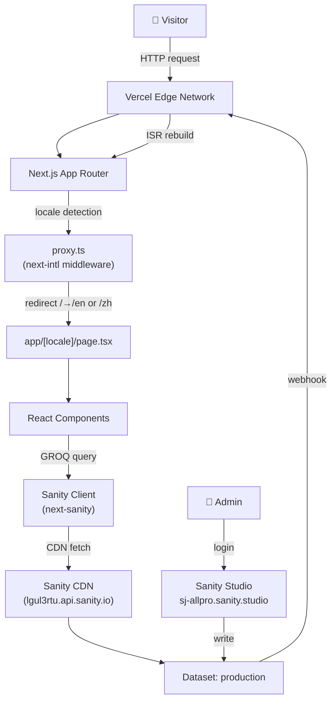
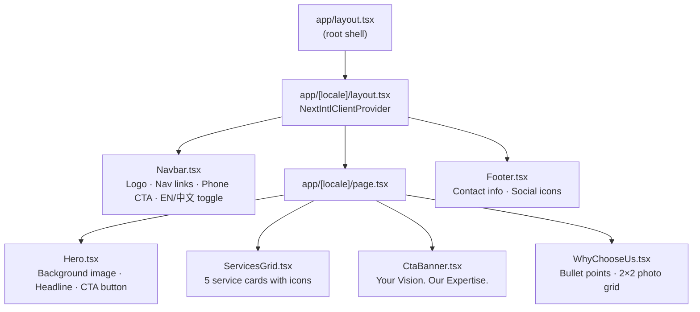
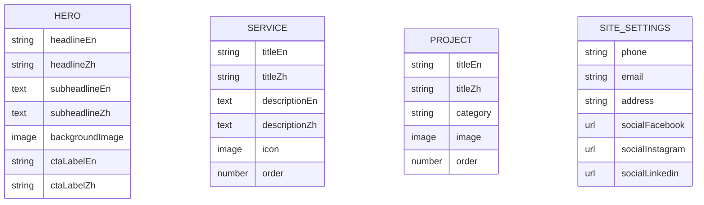
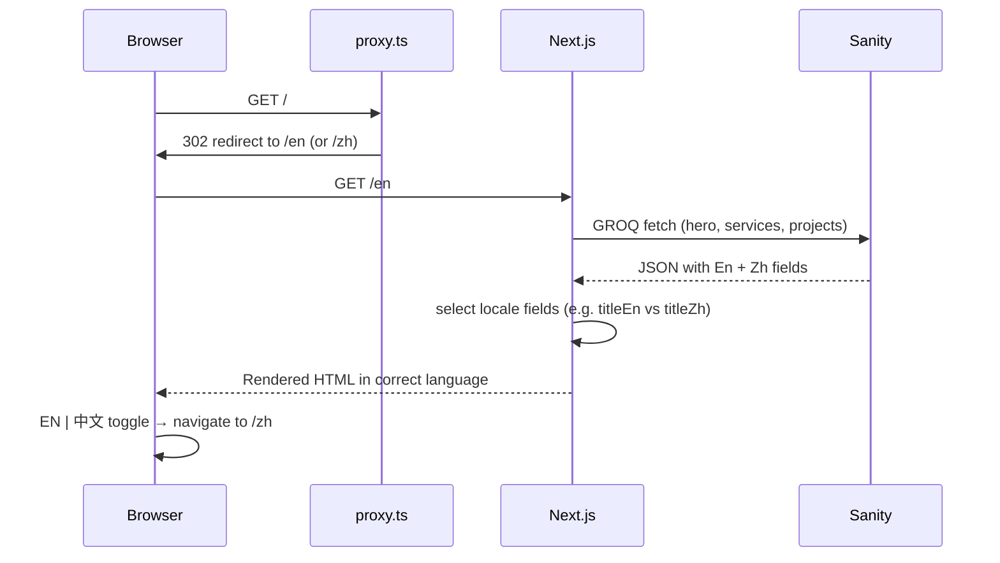

# SJ All-Pro Construction Website

Bilingual (English / 中文) construction company website for **SJ All-Pro Construction Ltd.**, built with Next.js, Tailwind CSS, and Sanity CMS.

**Live site:** `https://sj-website.vercel.app`  
**Admin studio:** `https://sj-allpro.sanity.studio`

---

## Tech Stack

| Layer | Technology |
|---|---|
| Framework | Next.js 16 (App Router) |
| Language | TypeScript |
| Styling | Tailwind CSS v4 |
| CMS | Sanity.io v3 |
| i18n | next-intl (EN / ZH) |
| Deployment | Vercel |

---

## Architecture



---

## Page Layout



---

## Sanity CMS Schema



---

## Bilingual Data Flow



---

## Local Development

```bash
# Install dependencies
npm install

# Add environment variables
cp .env.local.example .env.local
# Fill in NEXT_PUBLIC_SANITY_PROJECT_ID and SANITY_API_READ_TOKEN

# Start dev server
npm run dev
# → http://localhost:3000
```

### Environment Variables

| Variable | Description |
|---|---|
| `NEXT_PUBLIC_SANITY_PROJECT_ID` | Sanity project ID (`lgul3rtu`) |
| `NEXT_PUBLIC_SANITY_DATASET` | Sanity dataset (default: `production`) |
| `SANITY_API_READ_TOKEN` | Sanity read-only API token |

---

## Project Structure

```
sj-website/
├── app/
│   ├── [locale]/
│   │   ├── layout.tsx       # Locale layout with NextIntlClientProvider
│   │   └── page.tsx         # Home page
│   ├── layout.tsx           # Root shell
│   └── globals.css          # Tailwind + brand color tokens
├── components/
│   ├── Navbar.tsx
│   ├── Hero.tsx
│   ├── ServicesGrid.tsx
│   ├── CtaBanner.tsx
│   ├── WhyChooseUs.tsx
│   └── Footer.tsx
├── sanity/
│   ├── schemas/             # hero, service, project, siteSettings
│   └── lib/                 # client.ts, image.ts
├── messages/
│   ├── en.json              # English UI strings
│   └── zh.json              # Chinese UI strings
├── i18n/
│   ├── routing.ts           # Locale config
│   └── request.ts           # Per-request message loader
├── proxy.ts                 # next-intl locale middleware
├── sanity.config.ts         # Sanity Studio config (root)
└── sanity.cli.ts            # Sanity CLI config
```

---

## Deployment

### Vercel (production)
1. Connect GitHub repo at [vercel.com/new](https://vercel.com/new)
2. Add the three environment variables above
3. Deploy — every push to `main` triggers an automatic redeploy

### Sanity Studio
```bash
npx sanity@latest deploy
# → https://sj-allpro.sanity.studio
```
